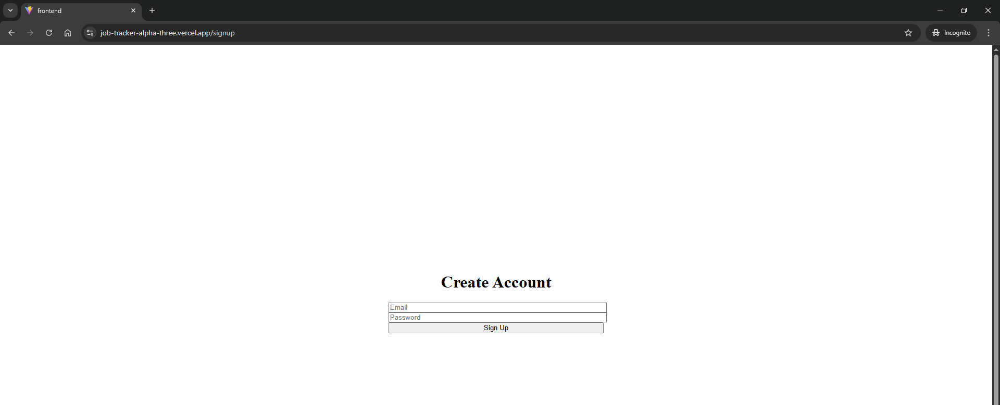
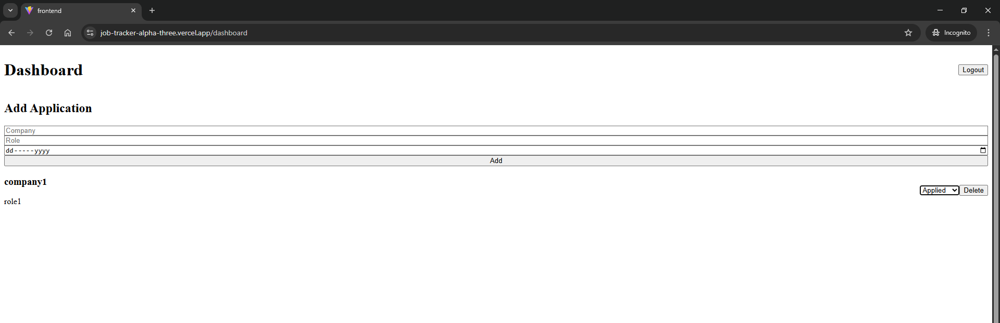

# Job Application Tracker

A full-stack web application that allows users to track their job applications.  
Users can sign up, log in, and manage applications with status updates.

## Live Demo
- Frontend: https://job-tracker-alpha-three.vercel.app/login
- Backend API: https://job-tracker-m2pb.onrender.com

## Features
- User authentication (JWT)
- Secure password hashing
- Create, update, and delete job applications
- Track application status (Applied, Interview, Offer, Rejected)
- Protected routes
- Responsive UI

## Tech Stack

### Backend
- Python
- Flask
- Flask-JWT-Extended
- SQLAlchemy
- SQLite
- Gunicorn

### Frontend
- React
- Vite
- Tailwind CSS

## Project Structure
job_tracker/
├── backend/
│ ├── app/
│ ├── run.py
│ └── requirements.txt
├── frontend/
│ ├── src/
│ └── package.json

## Screenshots

### Login Page


### Signup Page


### Dashboard



## Setup (Local Development)

### Backend
```bash
cd backend
python -m venv venv
venv\Scripts\activate
pip install -r requirements.txt
python run.py
```md
### Frontend
```bash
Copy code
cd frontend
npm install
npm run dev
Future Improvements
Search and filters
```md
Analytics dashboard

Better error handling

Replace the frontend URL with your actual Vercel link.

Then commit:
```bash
git add README.md
git commit -m "Add project README"
git push
